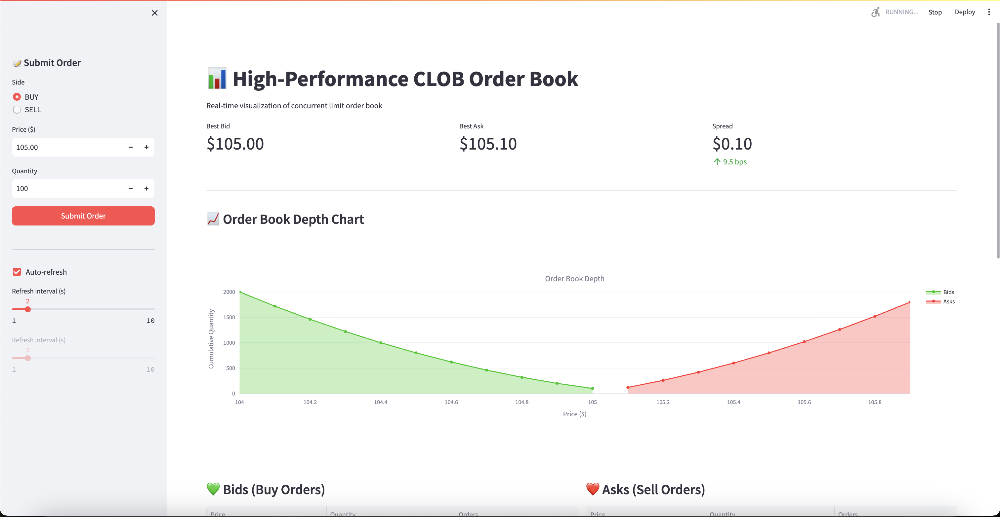

# High-Performance Concurrent Limit Order Book (CLOB)

A high-frequency trading (HFT) style Limit Order Book implemented in Java, designed to demonstrate **lock-free concurrency**, **zero-garbage collection (Zero-GC)** in the hot path, and **low-latency** architecture.



## 🚀 Key Features

### 1. Zero-GC Architecture
- **Object Pooling**: Pre-allocated `Order` objects (100k+) to avoid `new` keyword allocations during trading.
- **Primitive Collections**: Uses `fastutil` (e.g., `Long2ObjectOpenHashMap`) to avoid boxing/unboxing overhead for Order IDs.
- **Intrusive Linked Lists**: Custom `OrderLevel` doubly-linked list uses `Order` objects themselves as nodes, eliminating `Node` wrapper allocations.

### 2. Advanced Concurrency
- **Lock-Free Reads**: Uses `StampedLock` (Optimistic Read) for L1 Market Data (Best Bid/Ask) access.
- **Fine-Grained Locking**: Matches at specific price levels are protected by `ReentrantLock` per level, allowing concurrent matching at different prices.
- **Atomic Operations**: Uses `ConcurrentSkipListMap` with atomic `compute()` operations to handle order book updates without global locks.
- **Deadlock Prevention**: Strict locking hierarchy and "Mark-as-Removed" patterns to safely handle concurrent cancellations and matching.

### 3. High Performance
- **Data Structures**: `ConcurrentSkipListMap` for sorted price levels (O(log n)) and `Long2ObjectOpenHashMap` for O(1) order lookups.
- **Throughput**: Designed to sustain 100k+ orders/second on standard hardware.
- **Latency**: Sub-millisecond P99 latency for order matching.

## 🏗 Architecture

### Core Components
- **`OrderPool`**: A thread-safe, array-based stack for recycling `Order` objects.
- **`OrderBook`**: The central data structure managing Bids (Descending) and Asks (Ascending).
- **`OrderLevel`**: A custom linked list representing a queue of orders at a specific price.
- **`MatchingEngine`**: Implements the Price-Time Priority (FIFO) matching algorithm.
- **`OrderBookController`**: Exposes the system via a REST API (Javalin).

### Tech Stack
- **Language**: Java 17+
- **Build Tool**: Gradle
- **Web Server**: Javalin (Lightweight REST API)
- **UI**: Streamlit (Python) for real-time visualization
- **Collections**: fastutil, Java Concurrent Utils

## 🛠 Setup & Usage

### Prerequisites
- Java 17+
- Python 3.8+ (for UI)

### 1. Build the Project
```bash
./gradlew build
```

### 2. Run the Backend Server
Starts the CLOB engine and REST API on port 8080.
```bash
./gradlew runApiServer
```

### 3. Run the Visualization UI
Starts the Streamlit dashboard on port 8501.
```bash
pip install -r ui/requirements.txt
streamlit run ui/streamlit_app.py
```

## 📡 API Documentation

The system exposes a REST API at `http://localhost:8080`.

| Method | Endpoint | Description |
| :--- | :--- | :--- |
| `GET` | `/api/book` | Get full order book snapshot (L2 Depth) |
| `GET` | `/api/quote` | Get Best Bid and Best Ask (L1) |
| `POST` | `/api/orders` | Submit a new Limit Order |
| `DELETE` | `/api/orders/{id}` | Cancel an order by ID |
| `GET` | `/api/trades` | Get list of recent trades |
| `GET` | `/api/stats` | Get system statistics (Pool usage, etc.) |

### Example: Submit Order
```json
POST /api/orders
{
  "side": "BUY",
  "price": 10500,
  "quantity": 100
}
```
*Note: Price is fixed-point (10500 = $105.00)*

## 🧪 Performance Testing

To run the JMH microbenchmarks (if configured):
```bash
./gradlew jmh
```

## 📂 Project Structure
```
src/main/java/com/hft/clob/
├── api/            # REST API Controller
├── core/           # Core Data Structures (Order, Book, Pool)
├── engine/         # Matching Logic
└── ApiServer.java  # Application Entry Point
ui/                 # Streamlit Dashboard
```

## 📝 License
MIT License
