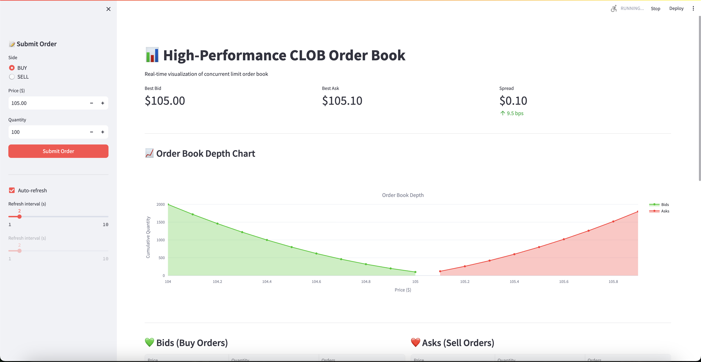
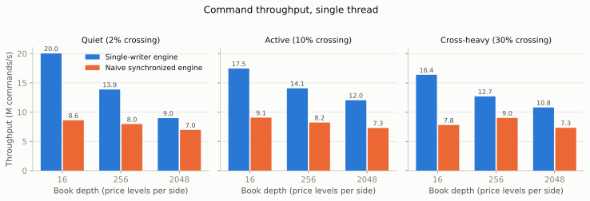
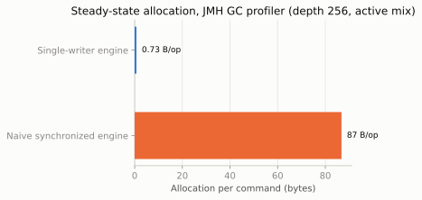
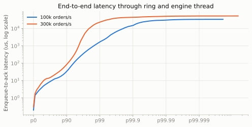

# Limit Order Book

A single-writer limit order book and matching engine in Java, built the way
real matching engines are built: one thread owns all book state, commands
flow in through a lock-free MPSC ring buffer, the data plane allocates
nothing, and every performance claim in this README is backed by committed
benchmark data you can regenerate.

**[Live demo dashboard](https://limit-order-book.streamlit.app/)** (Streamlit
UI polling the REST API)



## Design in one diagram

```
producer threads (REST handlers, load generators)
      |                                    reader threads
      v                                          |
  MPSC command ring (lock-free, preallocated)    v
      |                                    L1 seqlock quote  <- published after
      v                                          ^              every command
  engine thread: matching + book  ---------------+
      |
      v
  response futures, trade tape, L2/stats snapshots
```

- **Single-writer core.** The matching engine, price trees, order index,
  and pools are owned by one thread. No locks in the book, no interleavings
  to reason about: the classic concurrent-book races (lost orders, double
  pool returns, a crossed book) are structurally inexpressible.
- **Lock-free command ring.** A bounded Vyukov-style MPSC ring of
  preallocated command slots, with padded cursors against false sharing and
  a four-step release/acquire protocol documented in the code.
- **Zero-allocation data plane.** Orders and price levels are pooled and
  intrusive: orders are their own FIFO queue nodes, levels are their own
  AVL tree nodes, fills are reported through primitive-argument callbacks.
  Proven three ways: exact `ThreadMXBean` byte counting (0 bytes over 40M
  operations), an Epsilon GC endurance run (80M operations on a 256 MB
  heap with a collector that never collects), and the JMH GC profiler on
  every published run.
- **Lock-free market data.** Top of book through a seqlock (wait-free
  writer, retrying readers); depth, trades, and stats as engine-built
  snapshots that are internally consistent by construction.
- **A naive baseline that keeps everything honest.** A deliberately simple
  synchronized TreeMap engine implements the same contract. It is the
  benchmark comparison target and the oracle for differential testing.

The full design rationale is in **[docs/ARCHITECTURE.md](docs/ARCHITECTURE.md)**.

## Measured performance

Methodology, environment, and raw data: **[docs/PERFORMANCE.md](docs/PERFORMANCE.md)**.
All graphs regenerate from committed data with `python scripts/plot_benchmarks.py`.

### Throughput (single thread, by book depth and workload mix)



### Allocation per command (JMH GC profiler)



### End-to-end latency through ring and engine (coordinated-omission corrected)



## Running it

Requires JDK 25 (the Gradle toolchain provisions it automatically) and
Python 3.8+ for the dashboard.

```bash
# Build and test everything
./gradlew build

# Start the REST API on port 8080 (seeds a demo book)
./gradlew runApiServer

# Start the dashboard on port 8501
pip install -r ui/requirements.txt
streamlit run ui/streamlit_app.py
```

Or both at once: `./start-ui.sh`

## REST API

| Method | Endpoint | Description |
| :--- | :--- | :--- |
| `GET` | `/api/book` | Order book snapshot (L2 depth) |
| `GET` | `/api/quote` | Best bid and ask (L1, served from the seqlock) |
| `POST` | `/api/orders` | Submit a limit order |
| `DELETE` | `/api/orders/{id}` | Cancel an order |
| `GET` | `/api/trades` | Recent trades |
| `GET` | `/api/stats` | Engine statistics |
| `GET` | `/health` | Health check |

```json
POST /api/orders
{
  "side": "BUY",
  "price": 10500,
  "quantity": 100
}
```

Prices are fixed-point integers (10500 = $105.00). A crossing order matches
immediately at the resting order's price; the remainder rests on the book.

## Testing

```bash
./gradlew test
```

- **Differential tests**: seeded random command streams (150k commands per
  seed) run against both the optimized engine and the naive oracle, which
  must produce byte-identical event sequences and identical final books.
- **Contract tests**: one behavioral suite runs against both engine
  implementations.
- **Concurrency stress**: 800k commands through the ring from four
  producers with per-producer FIFO and exact-count assertions; a
  conservation test fires 100k concurrent orders and proves that submitted
  quantity equals filled plus canceled quantity, buy volume equals sell
  volume, and the pools reconcile exactly.
- **Seqlock torn-read tests**, **AVL structural validation** against a
  reference implementation, and **wire-contract tests** that pin the JSON
  the deployed dashboard consumes.

## Benchmarks

```bash
# Full suite (about half an hour on a quiet machine)
bash scripts/run_benchmarks.sh

# The zero-allocation proof alone
./gradlew :core:jmhJar
java -cp core/build/libs/core-2.0.0-jmh.jar \
    io.github.rajeevchaurasia.orderbook.bench.AllocationCheck
```

## Project structure

```
core/   the engine: no framework dependencies (fastutil only)
  book/        Order, OrderLevel, pools, intrusive AVL LevelTree, OrderBook
  engine/      MatchingEngine, EngineLoop (the single writer), listener API
  ring/        MpscCommandRing, command slots
  gateway/     EngineGateway: producer-facing API with backpressure
  marketdata/  L1Quote seqlock, TradeTape, snapshot records
  baseline/    NaiveMatchingEngine: the oracle and benchmark baseline
  src/jmh/     JMH suite, workload generator, AllocationCheck
app/    the demo surface
  api/         Javalin REST controller and DTOs
  loadtest/    HdrHistogram end-to-end latency harness
docs/   ARCHITECTURE.md, PERFORMANCE.md, benchmark data and graphs
```

## Limitations and future work

Single instrument (multi-symbol is a router over per-shard engines), no
persistence or replay journal yet, tree-based book rather than a price
ladder, REST-only ingress, and no exotic order types. Each is discussed at
the end of [docs/ARCHITECTURE.md](docs/ARCHITECTURE.md#limitations-and-future-work).

## License

[MIT](LICENSE)
